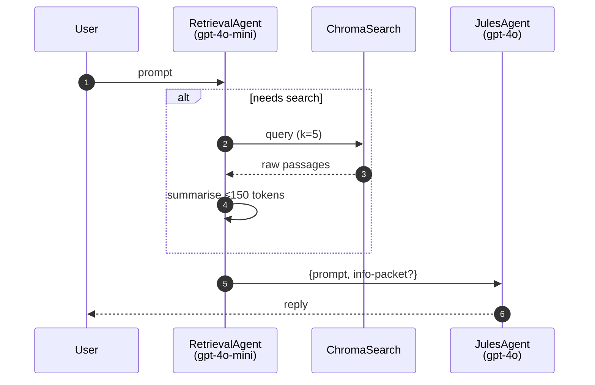

```mermaid
sequenceDiagram
    autonumber
    participant U as User
    participant R as RetrievalAgent<br/>(gpt-4o-mini)
    participant S as ChromaSearch
    participant J as JulesAgent<br/>(gpt-4o)

    U->>R: prompt
    alt needs search
        R->>S: query (k=5)
        S-->>R: raw passages
        R->>R: summarise ≤150 tokens
    end
    R->>J: {prompt, info-packet?}
    J-->>U: reply
```

