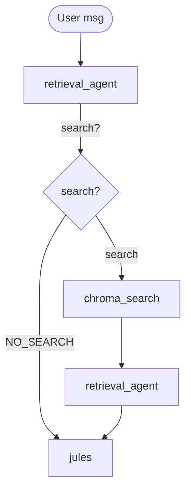

# Graph Architecture

```mermaid
graph TD
    UA([User msg]) --> R1[retrieval_agent]
    R1 -->|search?| S{search?}
    S -- NO_SEARCH --> J[jules]
    S -- search --> CS[chroma_search]
    CS --> R2[retrieval_agent]
    R2 --> J
```

`config/agents.toml` controls the models, `top_k`, and info packet length at runtime.
