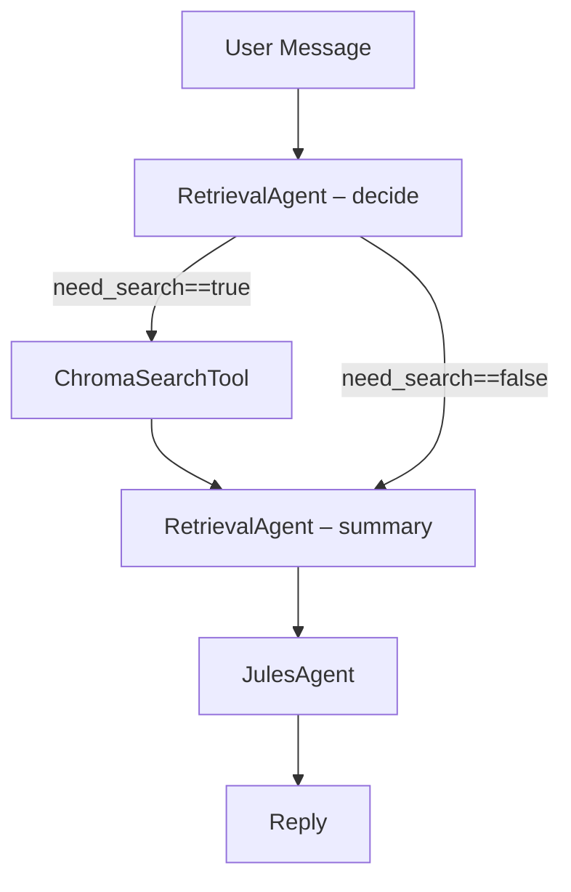

# Graph v6 – Retrieval-aware Pipeline

Key points

* RetrievalAgent decides if external context is required and, when so, issues a
  `search_chroma` function-call handled by the host LangGraph edge.
* Chroma results are summarised into a ≤150-token cheat-sheet injected into
  Jules’ prompt.
* All limits and model choices live in `config/agents.toml`.

See `src/jules/graph_v6.py` for implementation details.

