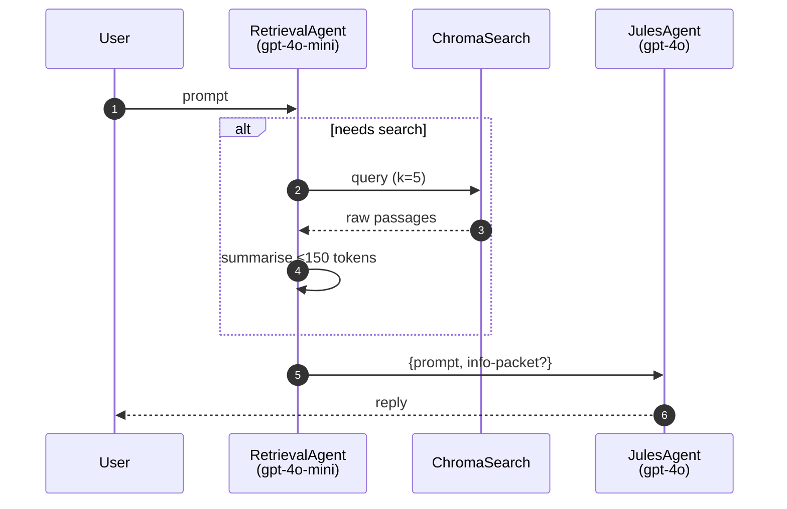

You are already in the correct feature branch. There are artifacts in the working tree that belong to the below outlined working order. 

Review the work order and compare against the working tree and code base.
Outline:
- incompleted items and work that is still outstanding.
- errors or problems
- a percentage number indicating the progress of the work order.

# ──────────────────────────────────────────────────────────────────────────────
# Work‑order NG‑001‑FINAL · “Retrieval‑aware Jules (green‑field replacement)”
# Repo: github.com/rupjae/jules              ·           Target tag: v1.0.0
# Author: ChatGPT (Jules DEV)                ·          Date: 2025‑07‑24
# ──────────────────────────────────────────────────────────────────────────────
#
# TABLE OF CONTENTS
#   0.  Executive overview  (WHY)
#   1.  Obsolete artefacts to DELETE
#   2.  New configuration & loader
#   3.  RetrievalAgent implementation
#   4.  ChromaSearch tool wrapper
#   5.  Next‑gen LangGraph pipeline
#   6.  FastAPI / SSE wiring changes
#   7.  Front‑end additions & rewiring
#   8.  Documentation & tutorial
#   9.  Tests (backend & frontend)
#  10.  Dependencies & lint settings
#  11.  CI / Release checklist
# ──────────────────────────────────────────────────────────────────────────────


★ 0.  EXECUTIVE OVERVIEW
────────────────────────
We are replacing the single‑node “dump every fact into one prompt” flow with a
**two‑stage Retrieval‑Augmented Generation (RAG)** design.

```

User ─▶ RetrievalAgent (gpt‑4o‑mini)
├─ need\_search? ──╴ no ╶──▶ JulesAgent (gpt‑4o) ─▶ Reply
╰─ yes ╮
╰▶ ChromaSearch (k=5) ─▶ summarise ≤150 tokens (info‑packet)
╰───────────────▶ JulesAgent

```

* **Smaller model first** – decides if we need outside info, keeping cost low.  
* **Cheat‑sheet, not dump** – ≤150 tokens bullet list piped to Jules.  
* **Single search path** – `db.chroma.search()` via one wrapper.  
* **Power‑user transparency** – UI toggle shows the info‑packet.  
* **Config‑driven** – `config/agents.toml` holds all model / k / token limits.

Deliverables:
* **Green‑field only** – v0 graphs & shims are deleted.
* **Version 1.0.0** – semantic‑version major bump (breaking change).
* **Docs** – narrative, Mermaid, demo notebook.

───────────────────────────────────────────────────────────────────────────────


1.  OBSOLETE ARTEFACTS TO DELETE
────────────────────────────────
Delete these paths **completely**:

```

backend/app/graphs/main\_graph.py
backend/app/graphs/              # any other graph\_v\*.py, if present
tests/test\_*\_graph*.py
docs/arch/*graph*.md             # legacy diagrams / explanations

````

No code referring to them must survive the commit.

───────────────────────────────────────────────────────────────────────────────


2.  NEW CONFIGURATION & LOADER
──────────────────────────────
### 2.1 File: `config/agents.toml`

```toml
[retrieval]
model         = "gpt-4o-mini"
k_hits        = 5
cheat_tokens  = 150   # hard cap for info‑packet

[jules]
model         = "gpt-4o"
````

### 2.2 File: `backend/app/config_agents.py`

```py
from pathlib import Path
from functools import lru_cache
from pydantic import BaseModel
import tomllib  # if py<3.11 add tomli dep and import tomli as tomllib

AGENTS_FILE = Path(__file__).resolve().parents[2] / "config" / "agents.toml"

class AgentCfg(BaseModel):
    model: str
    k_hits: int | None = None
    cheat_tokens: int | None = None

class AgentsConfig(BaseModel):
    retrieval: AgentCfg
    jules: AgentCfg

@lru_cache
def get_cfg() -> AgentsConfig:
    data = tomllib.loads(AGENTS_FILE.read_text())
    return AgentsConfig(**data)
```

───────────────────────────────────────────────────────────────────────────────

3. RETRIEVALAGENT IMPLEMENTATION
   ─────────────────────────────────

### 3.1 Package scaffold

```
backend/app/agents/__init__.py
backend/app/agents/retrieval_agent.py
```

### 3.2 `retrieval_agent.py`

```py
"""
RetrievalAgent

• need_search(text) -> bool
• search_and_summarise(text) -> str  # ≤ cheat_tokens tokens
"""

from __future__ import annotations
from typing import Sequence
import tiktoken
from openai import AsyncOpenAI
from ..config_agents import get_cfg
from ..tools.chroma_search import chroma_search
from ..logging import trace  # project’s custom TRACE decorator

cfg = get_cfg().retrieval
ENC = tiktoken.encoding_for_model(cfg.model)
OAI = AsyncOpenAI()

KEYWORDS = {"cite", "source", "reference", "link", "doc", "document"}

def need_search(prompt: str) -> bool:
    # trivial heuristic first‑pass
    if any(k in prompt.lower() for k in KEYWORDS):
        return True
    return len(prompt.split()) > 75  # long question ⇒ probably needs context

@trace
async def search_and_summarise(prompt: str) -> str:
    hits: Sequence[str] = await chroma_search(prompt, k=cfg.k_hits)
    system = (
        "You are a concise research assistant. Summarise the passages into "
        "bullet points (no more than 150 tokens)."
    )
    user = "\n\n".join(hits)
    resp = await OAI.chat.completions.create(
        model=cfg.model,
        messages=[{"role": "system", "content": system},
                  {"role": "user", "content": user}],
        max_tokens=cfg.cheat_tokens,
        temperature=0.2,
    )
    summary = resp.choices[0].message.content.strip()
    # Hard‑enforce token limit
    tokens = ENC.encode(summary)
    if len(tokens) > cfg.cheat_tokens:
        summary = ENC.decode(tokens[: cfg.cheat_tokens])
    return summary
```

───────────────────────────────────────────────────────────────────────────────

4. CHROMASEARCH TOOL WRAPPER
   ─────────────────────────────
   \### `backend/app/tools/chroma_search.py`

```py
from ..db.chroma import search  # existing helper

async def chroma_search(query: str, k: int):
    # thin async wrapper
    return await search(query=query, k=k)
```

───────────────────────────────────────────────────────────────────────────────

5. NEXT‑GEN LANGGRAPH PIPELINE
   ───────────────────────────────

### 5.1 `backend/app/graphs/next_gen.py`

```py
from langgraph import StateGraph, Node, ConditionalEdge
from ..agents.retrieval_agent import need_search, search_and_summarise
from ..config_agents import get_cfg
from openai import AsyncOpenAI
from typing import TypedDict, Optional

class ChatState(TypedDict):
    prompt: str
    info_packet: Optional[str]
    partial: Optional[str]

cfg = get_cfg()
OAI = AsyncOpenAI()

async def retrieval_decide(state: ChatState) -> ChatState:
    if need_search(state["prompt"]):
        return state | {"search": True}
    return state | {"search": False}

async def retrieval_summarise(state: ChatState) -> ChatState:
    summary = await search_and_summarise(state["prompt"])
    return state | {"info_packet": summary}

async def jules_llm(state: ChatState) -> ChatState:
    messages = [{"role": "user", "content": state["prompt"]}]
    if state.get("info_packet"):
        messages.append(
            {"role": "system", "content": f"[Background notes]\n{state['info_packet']}"}
        )
    stream = await OAI.chat.completions.create(
        model=cfg.jules.model,
        messages=messages,
        stream=True,
        temperature=0.7,
    )
    partial = ""
    async for chunk in stream:
        token = chunk.choices[0].delta.content or ""
        partial += token
        yield {"partial": token}  # streamed token
    yield {"content": partial, "info_packet": state.get("info_packet")}

def build_graph():
    sg = StateGraph(ChatState)
    sg.add_node("retrieval_decide", Node(retrieval_decide))
    sg.add_node("retrieval_summarise", Node(retrieval_summarise))
    sg.add_node("jules_llm", Node(jules_llm, is_generator=True))
    sg.set_entry("retrieval_decide")

    sg.add_conditional_edges(
        "retrieval_decide",
        ConditionalEdge(
            lambda s: "retrieval_summarise" if s["search"] else "jules_llm"
        ),
    )
    sg.add_edge("retrieval_summarise", "jules_llm")
    sg.set_finish("jules_llm")
    return sg.compile()
```

───────────────────────────────────────────────────────────────────────────────

6. FASTAPI / SSE WIRING CHANGES
   ────────────────────────────────

### 6.1 `backend/app/main.py`

```diff
-from .graphs.main_graph import build_graph
+from .graphs.next_gen import build_graph
```

### 6.2 `backend/app/routers/chat.py`

```py
from fastapi import APIRouter
from fastapi.responses import EventSourceResponse
from .graph_runner import run_graph   # existing util adapted below

router = APIRouter()

@router.post("/chat/stream")
async def chat_stream(req: ChatRequest):
    graph = build_graph()
    state = {"prompt": req.prompt, "info_packet": None}
    async def event_generator():
        async for output in run_graph(graph, state):
            if "partial" in output:
                yield f"data: {output['partial']}\n\n"
        # graph done → send info_packet event
        yield "event: info_packet\n"
        pkt = output.get("info_packet")
        yield f"data: {pkt if pkt else 'null'}\n\n"
    return EventSourceResponse(event_generator())
```

───────────────────────────────────────────────────────────────────────────────

7. FRONT‑END ADDITIONS & REWIRING  (Next.js + MUI)
   ────────────────────────────────────────────────────

### 7.1 `frontend/src/components/InfoPacketToggle.tsx`

```tsx
import { useState, useEffect } from "react";
import Switch from "@mui/material/Switch";
const KEY = "showInfoPacket";

export default function InfoPacketToggle() {
  const [checked, setChecked] = useState(false);
  useEffect(() => {
    setChecked(localStorage.getItem(KEY) === "true");
  }, []);
  return (
    <label>
      Show Retrieval Info‑Packet{" "}
      <Switch
        checked={checked}
        onChange={(e) => {
          setChecked(e.target.checked);
          localStorage.setItem(KEY, String(e.target.checked));
        }}
      />
    </label>
  );
}
```

### 7.2 `frontend/src/lib/useChatStream.ts`

```ts
import { useEffect } from "react";

export function useChatStream(
  input: string,
  onToken: (t: string) => void,
  onInfo: (pkt: string | null) => void
) {
  useEffect(() => {
    const es = new EventSource("/api/chat/stream", {
      method: "POST",
      body: JSON.stringify({ prompt: input }),
    } as any);
    es.onmessage = (e) => onToken(e.data);
    es.addEventListener("info_packet", (e: MessageEvent) =>
      onInfo(e.data === "null" ? null : e.data)
    );
    return () => es.close();
  }, [input]);
}
```

### 7.3 Patch `frontend/src/components/Chat.tsx`

* Replace native `EventSource` logic with `useChatStream`.
* Store `infoPacket` on the last assistant message.
* Render:

```tsx
{showInfoPacket && msg.infoPacket && (
  <Collapse in>
    <Paper elevation={1} sx={{ p: 1, my: 1, bgcolor: "grey.100" }}>
      <pre style={{ margin: 0, whiteSpace: "pre-wrap" }}>{msg.infoPacket}</pre>
    </Paper>
  </Collapse>
)}
```

Ensure `showInfoPacket` is read from `localStorage`.

───────────────────────────────────────────────────────────────────────────────

8. DOCUMENTATION & TUTORIAL
   ────────────────────────────

### 8.1 `docs/arch/overview_rag.md`  (markdown)

* Narrative explanation (copy executive overview, expand with pros / cons).
* Glossary: RetrievalAgent, info‑packet, LangGraph node, SSE events.

### 8.2 `docs/arch/next_gen_graph.md`

````md

````

### 8.3 README.md

Add a new **Architecture** subsection linking to both docs above.

### 8.4 *(optional)* `notebook/rag_demo.ipynb`

* Jupyter notebook: issue two prompts, show info‑packet JSON and compare outputs.

───────────────────────────────────────────────────────────────────────────────

9. TESTS
   ─────────

### 9.1 Backend `tests/test_chat_flow.py`

```py
import pytest, anyio
from backend.app.graphs.next_gen import build_graph

@pytest.mark.anyio
async def test_no_search_path(monkeypatch):
    from backend.app.agents import retrieval_agent as ra
    monkeypatch.setattr(ra, "need_search", lambda _: False)
    graph = build_graph()
    state = {"prompt": "hello", "info_packet": None}
    outputs = [o async for o in graph.stream(state)]
    assert any("content" in o for o in outputs)
    assert outputs[-1].get("info_packet") is None

@pytest.mark.anyio
async def test_search_path(monkeypatch):
    from backend.app.agents import retrieval_agent as ra
    monkeypatch.setattr(ra, "need_search", lambda _: True)
    monkeypatch.setattr(ra, "search_and_summarise", lambda *_: "• fact A\n• fact B")
    graph = build_graph()
    state = {"prompt": "Please cite sources about X", "info_packet": None}
    outputs = [o async for o in graph.stream(state)]
    pkt = outputs[-1]["info_packet"]
    assert pkt.startswith("•")
    assert len(pkt.split()) <= 150
```

### 9.2 Frontend `__tests__/infoPacketToggle.test.tsx`

* Use Vitest + RTL:

  * render `<Chat>` with mocked SSE; ensure info‑packet collapses when toggle ON.

───────────────────────────────────────────────────────────────────────────────

10. DEPENDENCIES & LINT SETTINGS
    ─────────────────────────────────
    **pyproject.toml**

```toml
[tool.poetry.dependencies]
langgraph = "^0.3"
tiktoken  = "^0.6"
tomli     = "^2.0"          # omit if py≥3.11
```

Remove any unused legacy graph libs.

**frontend/package.json**

```jsonc
{
  "dependencies": {
    "@mui/material": "^5.15",
    "@mui/icons-material": "^5.15"
  },
  "devDependencies": {
    "vitest": "^1.5",
    "@testing-library/react": "^14.0"
  }
}
```

**Linters**

* ruff: add `exclude = ["docs/*", "notebook/*"]` if too noisy.
* mypy: strict, include new packages.

───────────────────────────────────────────────────────────────────────────────

11. CI / RELEASE CHECKLIST
    ───────────────────────────
12. `poetry run ruff check . --fix`
13. `poetry run black .`
14. `poetry run mypy --strict`
15. `poetry run pytest -q`
16. `pnpm run lint && pnpm run test`  (frontend)
17. Update `CHANGELOG.md`:

```
## [1.0.0] – 2025‑07‑24
### Added
* Retrieval‑aware two‑stage RAG pipeline (NG graph)
* Config‑driven agents.toml
* Info‑packet UI toggle
### Removed
* All legacy graph_v* code and docs
```

7. `poetry version 1.0.0`
8. `git tag v1.0.0 && git push --tags`
9. Deploy back‑end & front‑end (GH Actions pipelines already configured).

# END OF WORK‑ORDER NG‑001‑FINAL

# ──────────────────────────────────────────────────────────────────────────────

